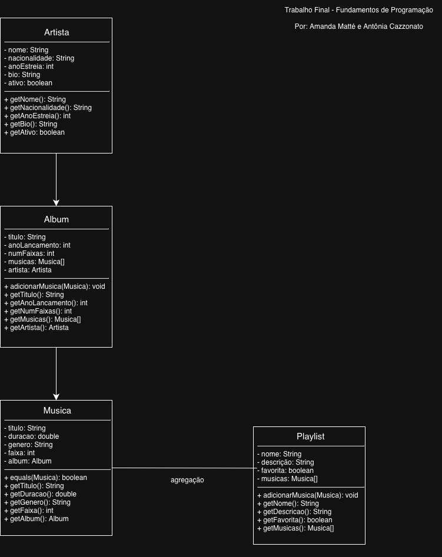

# Trabalho Final - Fundamentos de Programação
 
Nosso trabalho é um gerenciador de músicas e playlists desenvolvido em Java, por Amanda Matté (24107567) e Antônia Cazzonato (23102921).
 
## Descrição
 
O sistema permite cadastrar artistas, álbuns, músicas e playlists. Desenvolvemos um menu interativo onde é possível adicionar e listar todas essas informações de forma organizada.
 
## Como executar
 
Com o Java instalado, compile e execute pelo terminal:
 
```bash
javac *.java
java Main
```
 
## Diagrama de classes
 
**
 
O sistema tem quatro classes: `Artista`, `Album`, `Musica` e `Playlist`. A relação entre as três primeiras é de composição: um artista lança álbuns, e cada álbum contém suas músicas. Já a `Playlist` tem uma relação de agregação com `Musica`, ou seja, a música existe independentemente da playlist.
 
## Fontes de consulta
 
- Material disponibilizado pela professora em aula
- Consulta com aluno do 5º semestre de Ciência da Computação
  
## Uso de IA
 
Não utilizamos inteligência artificial no desenvolvimento do código deste projeto.
 
## Dificuldades
 
A maior dificuldade foi trabalhar com arrays de tamanho fixo. No método `adicionarMusica`, por exemplo, quando o array ficava cheio precisávamos redimensioná-lo, criando uma estrutura maior e copiando todos os dados da antiga para a nova.
 
## Divisão de tarefas
 
Fizemos o projeto juntas do início ao fim, sem divisão formal de partes.
 
## Lições aprendidas
 
O projeto nos ajudou a colocar em prática o que vimos em aula, como por exemplo: classes, arrays, métodos e relacionamentos entre objetos, aplicados a um tema que gostamos. Trabalhar com um sistema real fez tudo fazer mais sentido.

Aproveite! 🎵
